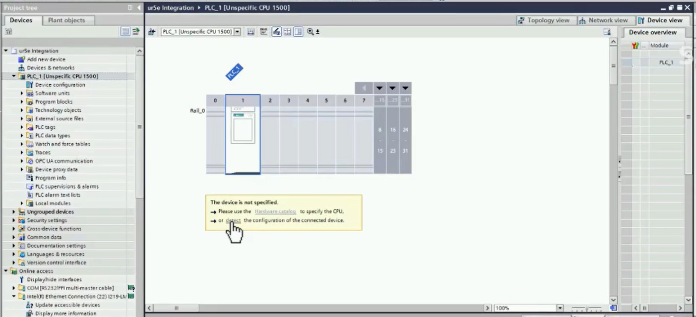
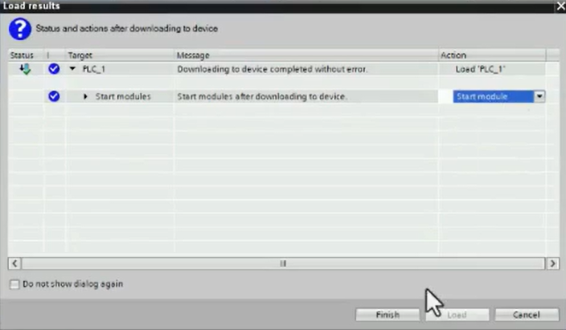

# Festo Cobótica TEC MTY
## About

## Tutorial

### SIEMENS PLC

>Starts at 14:53

UR5 a PLC Siemens

TIA Portal V20  
<a href = "https://www.universal-robots.com/articles/ur/interface-communication/profinet-how-to-guide-e-series/" >  UR PROFINET HOW-TO GUIDE E-SERIES </a>

PLC de la familia 1500

Download: 
- <a href = "https://s3-eu-west-1.amazonaws.com/ur-support-site/160022/GSDML-V2.42-UR-PROFIsafe-20220517.xml.zip"> GSDML-V2.42-UR-PROFIsafe-20220517.xml.zip </a> archivo GSD.
- <a href = "https://s3-eu-west-1.amazonaws.com/ur-support-site/160022/GSDML-0361-0001-UR.bmp"> GSDML-0361-0001-UR.bmp </a> BMP para que se muestre en la interfaz de TIA Portal.
- <a href = "https://s3-eu-west-1.amazonaws.com/ur-support-site/160022/UR_datastruct.udt" >  UR_datastruct.udt </a> Simplifica el proceso de mapeo de los registros a utilizar.
- <a href = "https://s3-eu-west-1.amazonaws.com/ur-support-site/160022/pn-iomessage.pdf" >  pn-iomessage.pdf </a> PROFINET I/O message, describe acerca de los registros que se van a compartir.

Paso a paso:

1. Crear un proyecto nuevo. (V20, V18, V17, V16).
2. Tener conectados: Robot, PLC, PC mediante ethernet o red WiFi.
3. **Open Project > Project Tree > Project >  Online access**: Verificar que el dispositivo (Robot) están agregados. (min 22.08 Webinar) Si no se muestra la dirección MAC [XX-XX-XX-XX-XX-XX] del dispositivo expandir cada dispositivo individualmente y se despliega la información.     
3.1. Verificar que la dirección IPv4 sea fija y esté en la misma red que el PLC y el UR.   
4. **Accessible Device [XX-XX-XX-XX-XX-XX] > Online & Diagnostics > Functions > Assign IP Address**. Asignar una dirección IP al PLC para estar en la misma red.   
Check azul indica la transferencia correcta de los parámetros (Esquina inferior derecha). Si no aparece la dirección IP en el dispositivo: **Online Access > Ethernet Connection > Update accessible devices.**   
5. **Accessible Device [XX-XX-XX-XX-XX-XX] > Online & Diagnostics > Functions > Assign PROFINET Device Name**: Asignar nombre PROFINET (25:49). Introducir un device name. Con la tecla Tab se rellena el nombre convertido. Revisar check azul. El nombre del dispositivo debe haber cambiado al asignado como device name (Ejemplo: **plc_1 [192.168.0.1]** )   
> Realizar pasos 4 y 5 para el PLC y para UR.
6. Desde el Teach Pendant: Habilitar comunicación PROFINET.   
> Cómo buena práctica al incluir un robot, renombrar Device Name con la serie del modelo y los últimos 4 dígitos del número de serie. (Ejemplo: **ur5e_0637**)
7. **Project Tree > Project > Add New Device > Controllers > SIMATIC S7-1500 > CPU > Unspecific S7-1500 CPU**: En caso de desconocer el CPU específico, utilizar Unspecific S7-1500 CPU.    
7.1 Activar licencia de TIA Portal.   
8. **Project Tree > Project > PLC_1 [Unspecific CPU 1500 > Hardware detection for PLC_1] > Start Search** : Detectar la configuración del PLC de manera automática.       
9. **PLC_1 > Properties > PROFINET Interface [x1] > Properties > Ethernet Addresses**     
9.1 **Interface networked with** En subnet dar click en "Add new subnet".  
9.2 **Internet protocol version 4 (IPv4)** Set IP address in the project (datos pre-establecidos). 
9.3 **PROFINET** **Desactivar** Generate PROFINET device name automatically. Reemplazar por nombre preestablecido de dispositivo. (Ejemplo: **plc_1**). Dar click nuevamente en Tab para generar nombre convertido.     
10. **Save Project** Seleccionar carpeta de PLC_1(CPU #####) y dar click en Save Project para guardar cambios en la configuración. 
    
 Una vez establecido el dispositivo y la subred, se agrega el robot con los archivos descargados.  

11. **Options > Manage general station description files (GSD)** Seleccionar ruta de acceso para los archivos descargados (1 carpeta con 4 docs descomprimidos) e instalar el dispositivo.    
    

12. Una vez instalado el dispositvo, verificar en **Hardware Catalog> Other field devices> PROFINET IO> I/O> Universal Robots A/S> Collaborative Robot> V1.0** que se encuentre el dispositivo instalado, arrastrar hasta la _Network View_ y conectar a la red PROFINET.     
    

13. Verificar el dispositivo en la red y renombrar nombre PROFINET.         

14. En **Devices&Networks> Device View> Device overview** agregar los módulos (min. 45:44) para obtener y enviar información entre el UR y el PLC.    
    

15. En **Project Tree> Devices> Project> PLC_1 [CPU ]> External source files> Add new external file**. Seleccionar la carpeta creada e integrar el archivo .udt para posteriormente generar bloques a partir del archivo y verificar que se crearon correctamente.
    

16. Crear una nueva tabla de tags y carpetas de nombre _Robot To PLC_ y _PLC To Robot_. Las direcciones se asignan automáticamente, lo más relevante son los data types **UR_T2O** y **UR_O2T**. 
      

17. Guardar, compilar y verificar que no hayan errores y descargar al dispositivo.     

18. Cargar al PLC.

    
Seleccionar module
    

19. Desde el tag table monitorear los valores con monitor all.   

20. Realizar un bloque en escalera para enlazar memorias de control con los registros a maniplar del UR, al final deberá aparecer algo así.
    

### FESTO Station
> Comienza en el 96:48

Herramientas: 
- Pinzas para pelar cable y corte de cinchos
- Llave Allen 5 (mm)
- Llave Allen 3 (mm)
- Llave Allen 2
- Desarmador plano 1.5
- Perico

<a href = 'files/Installation Guide V1.3.3_ENGLISH.pdf'>Guía de Instalación (Inglés) </a>  
Montar el robot UR atornillando con una llave allen de 5mm el tornillo superior derecho (visto desde la salida del cable) a la **ranura número 7** de la estación y el tornillo inferior izquierdo a la **ranúra número 7**.
    

Conectar cable al controlador, embona y se asegura.
    

Conectar cable de alimentación de 110 VAC. 
    

Colocar un tornillo tipo perno a la parte de acoplamiento y atornillar con una llave allen de 1.5 mm hasta que es visible en uno de los barrenos internos, seguido, realizar lo mismo para el barreno del lado contrario.

     

Montar gripper y atornillar con llave de 3mm hasta que la cabeza quede al raz de la brida. 

     
### UR Setup